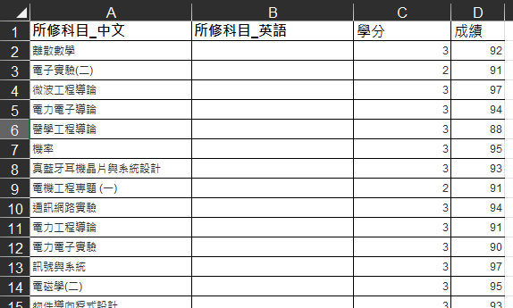
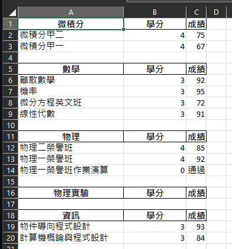
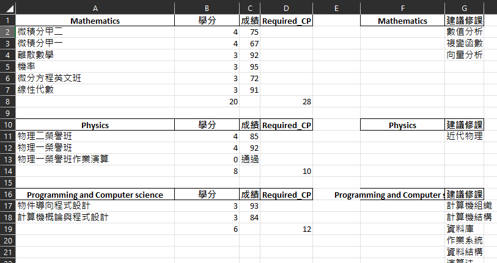
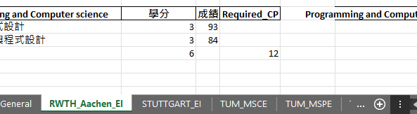

# TaiGer_Transcript-Program_Comparer
## Demo
### Student transcript as input:


### Generated file as output:
- According to the course category, the courses will be classified by keywords compared algorithms:




### Generated file as output:
- Depending on the University's course requirements for each course category, the pre-classified courses will be mapped to the corresponding categories by the requirements of the university:
- For those who still pursuing their degree, a list of suggested courses are listed.



### Generated file as output:
- By hard-coded each rule from all the universities, the course analysis will be significantly faster.
  


## Project structure:
```
/
├───database    
│   ├───ComputerScience     
│   │   ├─── CS_Course_database.xlsx    
│   │   ├─── CS_KEYWORDS.py     
│   │   ├─── CS_Programs.xlsx        
│   │   └─── CS_sorter.py           
│   ├───ElectricalEngineering       
│   │   ├─── ......                      
│   ├───Management                  
│   │   ├─── ......                 
│   └───MechanicalEngineering       
│   │   ├─── ......             
├───CourseSuggestionAlgorithms.py   
├───util.py 
├───cell_formatter.py
├───requirements.txt
└───main.py                          
```

## Example: 
### CS_Course_database.xlsx:
All course that students can take in their faculty. (here: Computer Science) 

### CS_KEYWORDS.py:
Keywords collection for the relevant course category

### CS_Programs.xlsx:
Program to be analyzed selector

### CS_sorter.py:
main function of the program analyzer for the program (here Computer Science for example)

### CourseSuggestionAlgorithms.py
Course Suggestion Algorithms

### util.py:
encapsulate the functions of manipulating excel file

### cell_formatter.py:
make color on the excel

### requirements.txt:
Record the needed python packages.

### main.py:
Software entry point


## Program Analyzer funcionality :
Available programs analyzer:
```
ee:   Electrical/Electronics Engineering
cs:   Computer Science, Data Science
me:   Mechanical Engineering, Robotics
dsbi: Data Science/Business Informatics
mgm:  Management, Business Administration
```
## Enviroment :
The Analyzer is purely implemented in Python with the version:
```
Python 3.8
```

## Installation of the requirement Python package (under the project root):
The needed necessary packages are listed in requirements.txt. Use the following command to install the packages:
```
pip install -r requirements.txt
```

## How to use?
```
python main.py <transcript_course.xlsx> <ee/cs/me/dsbi/mgm>
```
